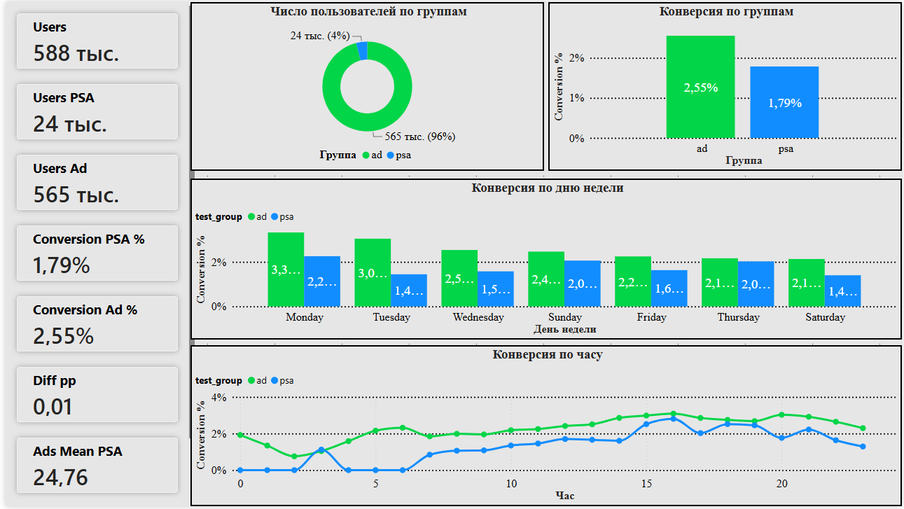

# Marketing A/B Testing — ads vs PSA

Пет-проект: marketing A/B analytics от CSV до дашборда.  
Датасет: https://www.kaggle.com/datasets/faviovaz/marketing-ab-testing

~588 101 пользователь. Рандом: **control = psa** (Public Service Announcement), **treatment = ad**.  

Python → MySQL → Power BI. Метрики сверены между слоями.

---

## Вердикт теста

**Катим ads** — реклама работает лучше, чем PSA. Её оставляем.

- Из тех, кто видел PSA, купили **~1.8%**. Из тех, кто видел рекламу — **~2.6%**. Разница **~0.8 пункта** в пользу ads.
- Это не случайность: тест показывает уверенный плюс.
- Группы по размеру (~4% psa / ~96% ad).
- Сколько рекламы в среднем показали — почти одинаково (медиана 12 vs 13). Значит, ads не накрутили лишними показами, просто конверсия выше.
- По дням и часам картина та же: ads обычно выше psa видно на гафиках pbi. 

**!!!** смотрим только факт покупки (`converted`). Денег и LTV в датасете нет — по этому и сказать нечего.

---

## О чём проект

| Слой | Что делает |
|------|------------|
| **Python** | ETL, ключ `user id`, parquet, A/B + SRM |
| **SQL (MySQL)** | схема, sanity, KPI n / conversion / total ads |
| **Power BI** | Overview (сплит, conversion, ads, day/hour) |

**Маршрут: sanity → A/B conversion → guardrail → вердикт**
- **sanity** — дубли userid, SRM vs 4/96
- **A/B** — `converted` по `test group`: n, rate, diff pp, z-test, CI
- **guardrail** — median / mean `total ads` 

**Зерно:** 1 строка = 1 пользователь.

---

## Данные и ETL

Исходник: **588 101** строк. Отвал чистки **0**. Дублей userid нет.

**Чистка:** `test group` , `converted` → 0/1, типы ads / day / hour.  

**Сплит** psa/ad ~4%/96%.

---

## Ключевые цифры

| Метрика | psa | ad | diff |
|---------|-----|----|------|
| n | 23 524 (4.00%) | 564 577 (96.00%) | SRM vs 4/96 p≈1.0 |
| converted | 1.79% | 2.55% | +0.77 pp, z≈7.37, p≈0 |
| total ads median | 12 | 13 | — |
| total ads mean | 24.76 | 24.82 | — |

Цифры совпадают в `scripts/report.py`, SQL (`04`–`06`) и карточках Power BI.

---

## Дашборд

Готовый отчёт: [`powerbi/Marketing_AB_Dashboard.pbix`](powerbi/Marketing_AB_Dashboard.pbix)

| Файл | Что |
|------|-----|
| `powerbi/screenshots/01_overview.png` | одна страница: сплит + conversion + ads + day/hour |

### Overview


- карточки: Users, Users PSA/Ad, Conversion PSA/Ad %, Diff pp, Ads Median/Mean
- конверсия по группам (столбцы)
- доля пользователей psa/ad (бублик)
- день и час — конверсия psa vs ad

---

## Pipeline

```text
data/marketing_AB.csv
        │
        ├─► scripts/pipeline.py    → data/processed/clean.parquet
        ├─► scripts/report.py      → z-test + total ads + вердикт
        ├─► scripts/load_mysql.py  → MySQL marketing_ab.clean_users
        ├─► sql/01 … 06            → schema, sanity, keys, KPI
        └─► powerbi/               → .pbix + screenshot
```

| Файл | Назначение |
|------|------------|
| `scripts/pipeline.py` | load, типы, clean, SRM, parquet |
| `scripts/report.py` | z-test converted, guardrail total ads, вердикт |
| `scripts/load_mysql.py` | parquet → MySQL |
| `sql/01`–`03` | схема, sanity, keys |
| `sql/04`–`06` | totals, by group, diff |

---

## Power BI — модель

Одна таблица `clean_users` (Import). Связей нет.

```dax
Users = COUNTROWS ( 'clean_users' )
Users PSA = CALCULATE ( [Users], 'clean_users'[test_group] = "psa" )
Users Ad = CALCULATE ( [Users], 'clean_users'[test_group] = "ad" )

Share PSA % = DIVIDE ( [Users PSA], [Users] ) * 100
Share Ad % = DIVIDE ( [Users Ad], [Users] ) * 100

Conversion % = AVERAGE ( 'clean_users'[converted] ) * 100
Conversion PSA % = CALCULATE ( [Conversion %], 'clean_users'[test_group] = "psa" )
Conversion Ad % = CALCULATE ( [Conversion %], 'clean_users'[test_group] = "ad" )
Diff pp = [Conversion Ad %] - [Conversion PSA %]

Ads Median = MEDIAN ( 'clean_users'[total_ads] )
Ads Mean = AVERAGE ( 'clean_users'[total_ads] )
```

---

## Стек

Python (pandas, pyarrow) → MySQL 8 → Power BI Desktop (DAX).

---

## Автор

@cat_main
